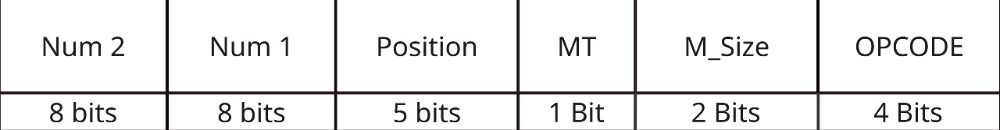

# Relatório: Desenvolvimento de Biblioteca assembly para comunicação entre HPS e FPGA

## 📌 Introdução
---
O uso de coprocessadores especializados tem se tornado cada vez mais relevante em aplicações que exigem alto desempenho em cálculos matriciais, como visão computacional, aprendizado de máquina e simulações científicas. Nesse contexto, o presente trabalho dá continuidade ao desenvolvimento de um coprocessador aritmético voltado para operações de multiplicação de matrizes, utilizando a plataforma DE1-SoC.

A proposta atual consiste em expandir a usabilidade do sistema previamente desenvolvido através da criação de uma biblioteca em linguagem Assembly. Essa biblioteca visa permitir que aplicações em alto nível possam se comunicar com o hardware de forma eficiente, simplificando o uso das operações aceleradas por hardware e maximizando o desempenho das aplicações que dependem de operações matriciais intensivas.

Além da biblioteca, este trabalho contempla a integração entre o código Assembly e aplicações escritas em linguagem C, o que exige um entendimento detalhado da arquitetura ARM, do mapeamento de memória e dos protocolos de comunicação entre o HPS (Hard Processor System) e a FPGA.

## 🎯 Objetivos e Requisitos
---
### Objetivos

Este projeto tem como principal objetivo permitir a reutilização das funcionalidades do coprocessador matricial por meio de uma biblioteca desenvolvida em Assembly. Com isso, espera-se alcançar:

- A facilitação do desenvolvimento de novas aplicações que demandem aceleração de cálculos matriciais;
- O fortalecimento da compreensão sobre a interação hardware-software na plataforma DE1-SoC;
- A prática na programação em linguagem Assembly para a arquitetura ARM;
- A aplicação dos conceitos de comunicação entre o HPS e a FPGA usando barramentos, PIOs e protocolos de handshake.

### Requisitos

Para atender às especificações do problema, o projeto deve cumprir os seguintes requisitos:

- A biblioteca deve ser escrita em linguagem Assembly;
- Devem ser implementadas funções que permitam o uso direto das operações oferecidas pelo coprocessador;
- O estilo de codificação deve seguir o guia disponível em [MaJerle/c-code-style](https://github.com/MaJerle/c-code-style);
- A biblioteca deve ser compatível com aplicações desenvolvidas em linguagem C;
- O sistema deve ser validado através de testes funcionais, com documentação adequada sobre o processo de compilação, configuração e uso.

## 🛠️ Recursos Utilizados
---

### 🔧 Quartus Prime
Síntese e Compilação:
O Quartus Prime é utilizado para compilar o projeto em Verilog, convertendo a descrição HDL em uma implementação física adequada para a FPGA. Durante esse processo, o compilador realiza a síntese lógica, o mapeamento e o ajuste de layout (place and route), otimizando as rotas lógicas e a alocação dos recursos internos da FPGA, conforme as recomendações descritas no User Guide: Compiler.

Análise de Timing:
Emprega-se o TimeQuest Timing Analyzer para validar as restrições temporais, como os tempos de setup e hold, além de identificar os caminhos críticos no design. Essa análise é essencial para garantir que o projeto opere de forma estável em frequência alvo, conforme metodologias detalhadas na documentação oficial.

Gravação na FPGA:
A programação da FPGA é realizada via Programmer, utilizando o cabo USB-Blaster. Esse procedimento suporta a gravação de múltiplos arquivos .sof, permitindo a configuração e reconfiguração do hardware conforme especificado nos guias técnicos da Intel.

Design Constraints:
São definidas as restrições de pinos e de clock por meio do Pin Planner e das ferramentas de timing. Essas constraints garantem que as conexões físicas e os requisitos temporais sejam atendidos, alinhando-se às práticas recomendadas no User Guide da ferramenta.

### 💻 FPGA
Especificações Técnicas:
A placa DE1-SoC, baseada no FPGA Cyclone V SoC (modelo 5CSEMA5F31C6N), conta com aproximadamente 85K elementos lógicos (LEs), 4.450 Kbits de memória embarcada e 6 blocos DSP de 18x18 bits. Essas características permitem a implementação de designs complexos e o processamento paralelo de dados.

Periféricos Utilizados:

Switches e LEDs: Utilizados para depuração e controle manual, permitindo, por exemplo, a seleção e visualização de operações matriciais.

Compatibilidade:
O projeto foi compilado com Quartus Prime 20.1.1 e testado com a versão 6.0.0 do CD-ROM da DE1-SoC (rev.H), conforme as especificações técnicas fornecidas pela Terasic.

Referência oficial: 

### ⚙ GCC

O GCC (GNU Compiler Collection) é um compilador robusto e amplamente utilizado em projetos que envolvem linguagens como C e Assembly. Neste projeto, o GCC foi utilizado para compilar tanto os arquivos escritos em linguagem C quanto os arquivos em Assembly, garantindo a geração de executáveis compatíveis com a arquitetura ARM presente na plataforma DE1-SoC.

No caso do código em C, o GCC foi responsável por compilar a lógica de interface com o usuário e o controle de chamadas para funções Assembly. Já para o Assembly, o compilador foi utilizado para traduzir as instruções de baixo nível que acessam diretamente os recursos do coprocessador, permitindo uma comunicação eficiente com o hardware.

A compilação foi automatizada por meio de um script `Makefile`, o que facilitou a integração dos diferentes módulos e agilizou o processo de testes.

Referência oficial: 

### 💻 Linguagens C e Assembly

A linguagem C foi empregada como camada de alto nível para interação com o usuário, gerenciamento de dados e chamada das rotinas implementadas em Assembly. Sua utilização permitiu desenvolver uma aplicação mais estruturada e acessível, mantendo a flexibilidade na manipulação de ponteiros e acesso a endereços de memória específicos.

Por outro lado, a linguagem Assembly foi utilizada para criar uma biblioteca especializada em acessar e acionar o coprocessador implementado na FPGA. Através do Assembly, foi possível implementar instruções personalizadas, manipular registradores e controlar com precisão o fluxo de dados entre o HPS e o hardware, respeitando os protocolos de comunicação definidos.

Essa combinação entre C e Assembly garantiu um equilíbrio entre desempenho e legibilidade, permitindo a construção de um sistema eficiente e de fácil manutenção.


## ⚙️ Desenvolvimento e Descrição em Alto Nível
---
### 🔧 Ajustes Realizados no Coprocessador

Inicialmente, foi realizada uma revisão na arquitetura do coprocessador previamente desenvolvido, com o objetivo de simplificar etapas do processamento e alinhar o projeto a práticas adotadas em arquiteturas mais modernas. Essa reformulação visou não apenas otimizar o desempenho geral do sistema, mas também facilitar a implementação da biblioteca em linguagem Assembly.

A principal modificação consistiu na reformulação do formato da instrução do coprocessador, que passou de 8 para 27 bits. Essa expansão permitiu a inclusão direta dos dados das matrizes dentro da própria instrução, eliminando a necessidade de etapas intermediárias de carregamento. Com isso, tornou-se possível estabelecer uma comunicação mais direta entre o processador e o coprocessador, viabilizando uma integração mais eficiente e simplificada no contexto da execução de operações matriciais.



| Campo    | Bits | Descrição                                                                 |
|----------|------|---------------------------------------------------------------------------|
| Num 2    | 8    | Segundo operando de 8 bits para a instrução (ex: elemento da matriz)      |
| Num 1    | 8    | Primeiro operando de 8 bits para a instrução (ex: elemento da matriz)     |
| Position | 5    | Posição dentro do registrador/matriz alvo (para operações de LOAD/STORE)  |
| MT       | 1    | Matriz Alvo (0 para Matriz A, 1 para Matriz B em operações de LOAD)       |
| M_Size   | 2    | Tamanho da Matriz (00: 2x2, 01: 3x3, 10: 4x4, 11: 5x5)                    |
| OPCODE   | 4    | Código da Operação (LOAD, STORE, SUM, MUL, DET, etc.)                     |

A nova implementação exigiu uma reformulação na forma como os dados eram inseridos nos registradores e enviados ao processador. Essa mudança foi uma consequência direta da modificação no formato da instrução, que passou a incorporar informações adicionais sobre os dados e suas posições.

A comunicação entre o processador e o coprocessador foi estruturada seguindo a metodologia mestre-escravo, onde o processador (mestre) envia instruções ao coprocessador (escravo), que as interpreta e executa. No caso das instruções do tipo `LOAD`, o processador transmite os valores das matrizes juntamente com suas posições codificadas dentro da própria instrução. O coprocessador então realiza o armazenamento desses valores nos registradores internos correspondentes.

De forma análoga, a instrução `STORE` é utilizada para retornar os resultados ao processador. Nessa operação, o coprocessador empacota quatro bytes de resultado e os envia ao HPS, respeitando a posição especificada na instrução recebida. Esse modelo de comunicação direta e estruturada permitiu maior controle sobre o fluxo de dados, além de garantir eficiência e sincronização entre os módulos envolvidos.

### 🔌 Comunicação Utilizada

A comunicação desenvolvida, como já mencionado, segue a arquitetura mestre-escravo, na qual o processador (mestre) envia instruções ao coprocessador (escravo), responsável por processá-las e retornar os dados. Esse envio é realizado por meio do barramento **Lightweight HPS-to-FPGA (LW-H2F)**, uma interface AXI disponível na plataforma DE1-SoC.

O barramento LW-H2F possui uma largura de 32 bits e foi projetado para transferências de controle e pequenos volumes de dados. Ele permite uma comunicação eficiente e simplificada entre o HPS (Hard Processor System) e a lógica programável da FPGA. Sua utilização neste projeto foi fundamental para garantir a troca rápida de comandos e dados entre as duas partes da placa, sem a necessidade de protocolos complexos.

#### 📥 PIOs – Parallel Input/Output

Outro componente essencial utilizado na comunicação foi o **PIO (Parallel Input/Output)**, disponível como periférico padrão no Platform Designer (Qsys) do Quartus. O PIO é um módulo simples que permite realizar leitura e escrita paralela de dados entre o HPS e a FPGA. Ele é amplamente utilizado para envio de sinais de controle, estados ou dados discretos em aplicações embarcadas.

No contexto deste projeto, os PIOs desempenharam múltiplas funções:

- Controle de sinais de sincronização entre o processador e o coprocessador (como “pronto” enviado pela FPGA), viabilizando um protocolo de handshaking confiável;
- Transmissão das instruções montadas no processador para o coprocessador, permitindo a ativação direta das operações matriciais;
- Envio de pacotes de bits do coprocessador para o HPS, contendo os resultados das operações, especialmente nos casos de instruções do tipo `STORE`.

Essa abordagem multifuncional com os PIOs proporcionou flexibilidade na comunicação e reduziu a complexidade de controle interno do sistema. O uso combinado do barramento AXI e dos PIOs resultou em um canal de comunicação robusto, eficiente e altamente adaptado às exigências do projeto.
#### 🤝 Protocolo de Handshaking

O protocolo de handshaking implementado entre o HPS e o coprocessador (FPGA) segue os seguintes passos:

1. **Envio da instrução**  
   - O HPS monta a instrução em Assembly e a escreve nos registradores via barramento e PIOs.  
   - Em seguida, o HPS aciona o sinal `Start` (coloca `Start = 1`) para indicar que há uma nova operação a ser executada.

2. **Modo de espera do HPS**  
   - Após ativar `Start`, o HPS entra em loop de espera, monitorando o sinal `Done_operation` vindo do coprocessador.

3. **Processamento pelo coprocessador**  
   - O coprocessador, ao detectar `Start = 1`, lê a instrução e executa a operação correspondente.  
   - Durante a execução, o coprocessador mantém `Done_operation = 0`.

4. **Conclusão da operação**  
   - Quando o coprocessador finaliza o processamento (por exemplo, multiplicação matricial ou empacotamento de bytes), ele coloca `Done_operation = 1`.  
   - Esse pulso indica ao HPS que a operação foi finalizada.

5. **Reset do ciclo**  
   - O HPS detecta `Done_operation = 1` e zera o sinal `Start` (`Start = 0`).  
   - Após limpar `Start`, o HPS  fica pronto para enviar a próxima instrução.

Esse fluxo garante sincronização precisa entre ambos os módulos, evitando condições de corrida e garantindo que cada instrução seja processada individualmente antes do envio da próxima.  


### 🧩 Código Assembly
O código Assembly (`driver.s`) é o núcleo da biblioteca de comunicação com o coprocessador FPGA. Suas principais responsabilidades e características são:

-   **Interface de Funções Globais:**
    -   `driver`: Função principal chamada pelo código C, orquestra as operações de `load`, `operation` e `store`. Recebe ponteiros para as matrizes A, B, R, o tamanho da matriz e o opcode da operação.
    -   `mmap_setup`: Responsável por abrir `/dev/mem` e mapear a região de memória física dos PIOs da FPGA para o espaço de endereçamento virtual do processo HPS.
    -   `mmap_cleanup`: Desfaz o mapeamento de memória e fecha o descritor de arquivo de `/dev/mem`.

-   **Montagem e Envio de Instruções (`load`, `operation`):**
    -   As sub-rotinas como `load2x2`, `load3x3`, `load4x4`, `load5x5` são responsáveis por carregar os dados das matrizes A e B para o coprocessador.
    -   Elas montam a instrução de 28 bits conforme o formato definido (Num1, Num2, Position, MT, M\_Size, OPCODE=LOAD). Por exemplo, em `load2x2` para a matriz A:
        -   `r6` (Num1), `r7` (Num2) são carregados dos ponteiros `matrixA`.
        -   `r3` (MT) é 0 para matriz A, 1 para matriz B.
        -   `r4` e `r5` (Position) indicam onde os dados devem ser escritos.
        -   `r12` contém `M_Size` e o `OPCODE` de LOAD (implicitamente 0000 para a carga).
        -   A instrução é combinada com `0x10000000` (Start bit) e escrita no `mapped_addr`.
    -   A sub-rotina `operation` (e suas ramificações como `sum`, `multiplication`, etc.) monta a instrução para a operação aritmética ou de manipulação desejada (OPCODE específico, M\_Size se aplicável) e a envia.

-   **Leitura de Resultados (`store`):**
    -   As sub-rotinas `store2x2`, `store3x3`, etc., preparam e enviam uma instrução de `STORE` (OPCODE `0x8`) para o coprocessador, especificando a posição e o tamanho da matriz de resultado.
    -   Após o handshake (`wait_for_done`), os dados do resultado são lidos do PIO no offset `0x10` (relativo a `mapped_addr`) e armazenados no ponteiro `matrixR`. Os bytes são extraídos da palavra de 32 bits lida.

-   **Mapeamento de Memória (`mmap_setup`, `mmap_cleanup`):**
    -   `mmap_setup`:
        1.  Abre o dispositivo `/dev/mem` com permissão de leitura e escrita (`O_RDWR`).
        2.  Utiliza a syscall `mmap` (número 192) para mapear `0x1000` bytes (4KB) da memória física a partir do endereço base do Lightweight HPS-to-FPGA bridge (endereço físico base `0xFF200000`, com o PIO específico residindo em um offset dentro desta ponte, o código usa `0xFF200` como base para `mmap`, que o kernel ajusta para o alinhamento da página). O endereço virtual retornado por `mmap` é armazenado em `mapped_addr`.
    -   `mmap_cleanup`:
        1.  Utiliza a syscall `munmap` (número 91) para liberar a região de memória mapeada.
        2.  Utiliza a syscall `close` (número 6) para fechar o descritor de arquivo de `/dev/mem`.

-   **Implementação do Handshake (`wait_for_done`, `restart`):**
    -   `wait_for_done`: Entra em um loop (`wait_loop`) lendo continuamente o registrador PIO no offset `0x30` de `mapped_addr`. Ele verifica se o bit 3 (`0x08`) está setado (sinal `Done_operation` do FPGA).
    -   `restart`: Após `Done_operation` ser detectado, esta parte (dentro de `wait_for_done`) envia `0x00000000` para o endereço base do PIO (`mapped_addr + 0x0`), efetivamente zerando o sinal `Start` para o coprocessador.

-   **Uso de Syscalls:**
    -   Syscalls são invocadas usando a instrução `svc #0`, com o número da syscall em `r7` e os argumentos nos registradores `r0-r5` conforme a convenção da ABI ARM EABI.
        -   `#5 (open)`: Usado em `mmap_setup`.
        -   `#192 (mmap2)`: Usado em `mmap_setup` para mapear memória.
        -   `#91 (munmap)`: Usado em `mmap_cleanup`.
        -   `#6 (close)`: Usado em `mmap_cleanup` (e em `fail_mmap`).
        -   `#4 (write)`: Usado na função `welcome` para imprimir uma mensagem de boas-vindas (não diretamente parte da lógica do driver, mas presente no arquivo).

### 💻 Integração com C
A integração entre a aplicação de alto nível em C (`main.c`) e a biblioteca Assembly (`driver.s`) é um aspecto crucial do projeto, permitindo que a complexidade da comunicação de baixo nível seja abstraída do usuário final.

-   **Interação com Usuário (`main.c`):**
    -   O programa C fornece uma interface de linha de comando simples para o usuário.
    -   Ele solicita ao usuário que escolha a operação matricial desejada (soma, subtração, multiplicação, oposta, transposta, multiplicação por escalar, determinante).
    -   Solicita o tamanho das matrizes (2x2, 3x3, 4x4 ou 5x5).
    -   Lê os elementos das matrizes de entrada (Matriz A e, se necessário, Matriz B) fornecidos pelo usuário.
    -   Aloca dinamicamente memória para as matrizes A, B e R (resultado) usando `calloc`.

-   **Chamada da Biblioteca em Assembly (`main.c` -> `driver.s`):**
    -   **Setup e Cleanup:** Antes de qualquer operação e após todas as operações, `main.c` chama as funções Assembly `mmap_setup()` e `mmap_cleanup()` respectivamente. `mmap_setup()` inicializa o mapeamento de memória necessário para que o código Assembly possa acessar os registradores PIO da FPGA. `mmap_cleanup()` libera esses recursos.
    -   **Função `driver`:** A função principal `driver` em Assembly é declarada como `extern` em C. Ela é chamada da seguinte forma:
        ```c
        driver(matrixA, matrixB, matrixR, size_mask(size), operation); //
        ```
        -   `matrixA`, `matrixB`, `matrixR`: São ponteiros para `int8_t` contendo os dados das matrizes. O Assembly acessará esses dados.
        -   `size_mask(size)`: Uma função C que converte o tamanho da matriz (2, 3, 4, 5) para o valor de `M_Size` esperado pelo coprocessador (0, 1, 2, 3).
        -   `operation`: O código da operação escolhido pelo usuário (1 para Soma, 2 para Subtração, etc.), que o Assembly usará para definir o `OPCODE`.
    -   **Impressão de Resultados:** Após a chamada `driver` retornar, `main.c` imprime a matriz resultado (`matrixR`) no console.
    -   **Liberação de Memória:** A memória alocada para as matrizes é liberada usando `free()`.

Essa arquitetura permite que o código C gerencie a lógica da aplicação e a interação com o usuário, enquanto o código Assembly lida eficientemente com a comunicação direta com o hardware do coprocessador na FPGA.

## 🧪 Testes, Resultados e Discussões

Esta seção detalha o processo de validação do sistema, os resultados alcançados e uma discussão sobre possíveis melhorias futuras.

### ✅ Testes Realizados

Para validar a funcionalidade da biblioteca Assembly e a correta operação do coprocessador matricial, foram realizados testes funcionais abrangentes. A aplicação em C (`main.c`) serviu como a principal ferramenta de teste, permitindo a inserção de diversos casos de teste e a observação dos resultados.

Os testes cobriram os seguintes aspectos:
-   **Todas as Operações Implementadas:** Cada uma das operações (Soma, Subtração, Multiplicação, Matriz Oposta, Transposta, Multiplicação por Escalar e Determinante) foi testada individualmente.
-   **Diferentes Tamanhos de Matriz:** As operações foram validadas para todos os tamanhos de matriz suportados pelo coprocessador (2x2, 3x3, 4x4 e 5x5), conforme selecionável pelo usuário no `main.c`.
-   **Valores de Entrada Variados:** Foram utilizados diferentes conjuntos de valores para os elementos das matrizes, incluindo:
    -   Valores positivos e negativos.
    -   Valores nulos.
    -   Valores que poderiam levar a resultados nos limites da representação de 8 bits com sinal (próximos de -128 e 127).
-   **Casos Específicos:**
    -   Multiplicação por matriz identidade.
    -   Multiplicação por matriz nula.
    -   Soma com matriz nula.
    -   Cálculo de determinante para matrizes singulares (resultado zero) e não singulares.
-   **Comunicação e Handshake:** A correta sincronização entre HPS e FPGA foi observada indiretamente através do sucesso das operações. O mecanismo de `wait_for_done` e o `restart` do ciclo foram cruciais e seu funcionamento correto é evidenciado pela capacidade de realizar múltiplas operações em sequência.
-   **Mapeamento de Memória:** O sucesso na chamada de `mmap_setup` e `mmap_cleanup` e a capacidade de ler e escrever nos PIOs confirmaram o funcionamento do mapeamento de memória.

Os resultados obtidos pelo coprocessador foram comparados com cálculos manuais ou resultados de calculadoras matriciais padrão para verificar a precisão.

### 📈 Resultados Obtidos

Os testes demonstraram que a biblioteca Assembly desenvolvida comunica-se com sucesso com o coprocessador matricial na FPGA. Todas as operações implementadas (soma, subtração, multiplicação, oposta, transposta, multiplicação por escalar e determinante) funcionaram corretamente para os tamanhos de matriz suportados (2x2, 3x3, 4x4 e 5x5).

-   A interface em C permitiu uma fácil interação e teste das funcionalidades do coprocessador.
-   O protocolo de handshaking mostrou-se robusto, garantindo a sincronização adequada entre o HPS e a FPGA para cada instrução enviada e resultado recebido.
-   O mapeamento de memória via `/dev/mem` foi eficaz para o acesso aos PIOs da FPGA.
-   Os objetivos do projeto, como facilitar o uso do coprocessador através de uma biblioteca Assembly e integrar com aplicações C, foram alcançados.

O sistema como um todo provou ser funcional, permitindo que o HPS delegue operações matriciais complexas para serem aceleradas pelo hardware customizado na FPGA.

### 💡 Discussão e Possíveis Melhorias

Apesar dos resultados positivos, alguns pontos podem ser discutidos e há espaço para melhorias futuras:

-   **Saturação do Overflow:**
    -   Atualmente, os elementos das matrizes são `int8_t`, variando de -128 a 127. As operações, especialmente a multiplicação, podem gerar resultados que excedem esse intervalo (overflow).
    -   O comportamento atual do coprocessador em caso de overflow (se ele satura o valor para o máximo/mínimo representável ou se ocorre um *wrap-around*) precisaria ser caracterizado detalhadamente. O código Assembly no HPS simplesmente lê os bytes de resultado (`strb r1, [r0, #0]`) sem tratamento explícito de overflow no lado do HPS.
    -   Uma melhoria seria implementar lógica de saturação no hardware do coprocessador para garantir que os resultados permaneçam dentro do intervalo válido, ou, alternativamente, expandir a largura de bits dos elementos da matriz resultado e dos acumuladores internos no coprocessador. O HPS poderia então ser notificado sobre a ocorrência de overflow/saturação.

-   **Implementação da Convolução em Nível de Hardware:**
    -   Uma expansão significativa da funcionalidade do coprocessador seria adicionar suporte para operações de convolução 2D. A convolução é uma operação fundamental em processamento de imagens e redes neurais convolucionais (CNNs).
    -   Isso exigiria modificações substanciais no hardware da FPGA, incluindo unidades de multiplicação-acumulação (MAC) mais eficientes, gerenciamento de janelas deslizantes e possivelmente FIFOs para streaming de dados.
    -   A biblioteca Assembly e a interface C também precisariam ser estendidas para suportar essa nova operação, incluindo a passagem de kernels de convolução e o manuseio de diferentes modos de padding.

-   **Otimização de Desempenho:**
    -   Embora o uso de um coprocessador já traga ganhos de desempenho, análises mais aprofundadas poderiam identificar gargalos. Por exemplo, a transferência de dados entre HPS e FPGA, elemento por elemento (ou dois por vez nas operações de `LOAD` atuais), pode ser um fator limitante para matrizes maiores.
    -   Explorar o uso de DMA (Direct Memory Access) para transferir blocos de matrizes inteiras entre a memória do HPS e a memória embarcada na FPGA (como M10K blocks) poderia reduzir significativamente a latência de comunicação.

-   **Interface de Usuário e Relato de Erros:**
    -   A interface C atual é básica. Poderia ser aprimorada com melhor validação de entrada e feedback mais detalhado ao usuário.
    -   O sistema de tratamento de erros, especialmente para falhas de comunicação ou erros reportados pela FPGA, poderia ser mais robusto.

-   **Suporte a Tipos de Dados Maiores:**
    -   Considerar o suporte a elementos de matriz com maior precisão (e.g., 16 bits, 32 bits, ou ponto flutuante) no coprocessador e na biblioteca Assembly para aplicações que demandem maior alcance dinâmico ou precisão.

Essas melhorias poderiam expandir significativamente a aplicabilidade e o desempenho do sistema de coprocessamento matricial.

---

## 👥 Este projeto foi desenvolvido por:

-   **Guilherme Fernandes Sardinha**
-   **Robson Carvalho de Souza**
-   **Lucas Damasceno da Conceição**

Agradecimentos ao(a) professor(a) **Wild Freitas da Silva Santos** pela orientação ao longo do projeto.
